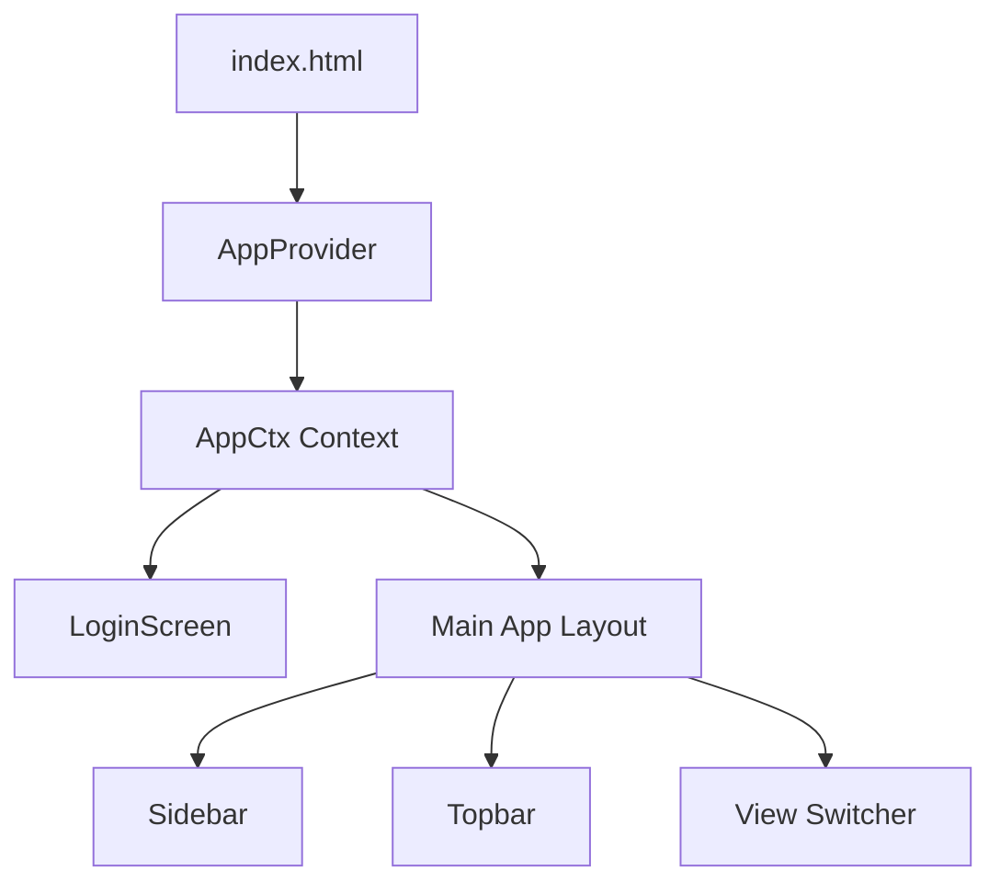

# MedAssist — Health Identity Platform Workflow & Architecture

This document provides a comprehensive overview of the MedAssist application's current architecture, screens, data flows, and identified areas for debugging and improvement.

---

## 1. System Overview & Technology Stack

MedAssist is a Single Page Application (SPA) designed as a centralized Health Identity Platform for Indian citizens and healthcare providers.

### Frontend Tech Stack
* **Framework**: React 18 & ReactDOM 18 loaded via UNPKG CDN.
* **Transpiler**: Babel Standalone loaded via UNPKG CDN (transpiles JSX in the browser).
* **Styling**: Tailwind CSS (CDN v3) with a custom extended theme (configured dynamically) and custom inline styling classes.
* **Icons**: Tabler Icons Webfont loaded via jsdelivr CDN.
* **Fonts**: Google Fonts (`Space Grotesk` for display, `Inter` for body).

---

## 2. Architecture & Navigation Layout

### Routing & Session Management
All routing, user authentication, and page state are governed by a single React Context:
* **Context**: `AppCtx` (defined in [index.html](file:///s:/anti%20gravity/MedAssist/index.html#L211))
* **Provider**: `AppProvider` (manages `user` state, `view` state, `login`, and `logout` functions).
* **Hook**: `useApp()` simplifies access to the session across components.

### Sidebar Navigation Structure
The sidebar navigation is controlled by the `USER_NAV` array. The views are organized into logical sections:

| Section | View ID | Label | Icon | Description |
| :--- | :--- | :--- | :--- | :--- |
| **Overview** | `dashboard` | Dashboard | `ti-layout-dashboard` | High-level summary & quick links. |
| | `summary` | Health summary | `ti-activity` | Vitals timeline and medical milestones. |
| **Records** | `medications` | Medications | `ti-pill` | Active prescriptions & add forms. |
| | `diseases` | Disease history | `ti-virus` | Chronic & resolved conditions. |
| | `surgeries` | Surgeries | `ti-cut` | List of surgical history. |
| | `reports` | Reports & labs | `ti-report-medical` | Lab tests & file dropzone. |
| | `documents` | Documents | `ti-file-text` | Searchable list of uploaded health docs. |
| **Identity** | `insurance` | Insurance & schemes | `ti-shield-check` | Ayushman Bharat & private coverages. |
| | `emergency` | Emergency contacts | `ti-phone-call` | Family/emergency contacts list. |
| | `identity` | Personal identity | `ti-id` | Demographics, DNR/donor toggles, & QR Code. |
| **Portals** | `doctor_view` | Doctor portal | `ti-stethoscope` | QR-authenticated clinical dashboard. |

---

## 3. Screen-by-Screen Workflows

### 3.1 Authentication Screen (`LoginScreen`)
* **Portal Tabs**: citizen ("Citizen"), doctor ("Doctor"), and hospital ("Hospital").
* **Citizen Verification Methods**: Aadhaar number, Retina scan, or Phone number.
* **Mock Login**: Clicking "Verify & Sign In" triggers a 1.1-second loading animation (`Verifying...`) before logging the user in.
* **Demonstration Access**: A "Skip — enter as demo citizen" button provides instant login using the mock patient data.

### 3.2 Dashboard View (`Dashboard`)
* **Emergency Banner**: A high-visibility red banner is displayed at the top if the Do Not Resuscitate (DNR) order is active.
* **Key Indicators**: Quick-read cards show Blood Group, Active Medications count, Active Conditions count, and Surgery count.
* **Interactive Summaries**: Grid of cards summarizing current medications, emergency contacts, active diseases, and recent documents. Buttons like "View All" or "Details" redirect to their respective views.

### 3.3 Health Summary (`SummaryView`)
* **Vitals Vitals History**: Displays HbA1c (May 2026), Blood Pressure (Jun 2026), Lipid Profile, and BMI.
* **Medical Milestones Timeline**: A vertical timeline mapping out historical events (e.g. Appendectomy in 2017, Diabetes diagnosis in 2020, Cataract surgery in 2024).

### 3.4 Medications View (`MedicationsView`)
* Lists all active prescriptions with dosages, frequencies, prescribing doctors, and dates.
* Includes a toggleable **Add Medication** card.

### 3.5 Reports & Documents (`ReportsView` / `DocumentsView`)
* **File Upload Dropzone**: Supports drag-and-drop or file selection. Dropping a file calculates the file size and prepends a new document entry to the local component state.
* **Search**: Allows users to filter documents by file name or laboratory source.

### 3.6 Personal Identity (`IdentityView`)
* Lists formal demographic records.
* Contains interactive toggle switches for directives: Do Not Resuscitate (DNR) and Organ Donation consent.
* Displays a **QR Code** that medical personnel can scan to access emergency summaries.

### 3.7 Doctor Portal (`DoctorView`)
* Simulates the view that an authenticated doctor sees after scanning a patient's QR code.
* **Emergency Summary Tab**: Quick scan of vital directives, chronic conditions, current medications, surgeries, and emergency contacts.
* **Full Record Tab**: Broad list of all conditions, medication logs, and surgical interventions.
* **Blood Bank Tab**: Details of nearby blood banks, distance away, availability status, and direct tap-to-call functionality.

---

## 4. Current Architecture Bugs & Limitations

During code review and visual testing, we cataloged the following issues to address in the debugging phase:

### State Management & Synchronization
* **Directives Desync**: The toggle controls for **DNR**, **Organ Donor**, and **Local Caching** in `IdentityView` only modify local React state inside that component. They do not update the global `user` context. As a result, switching pages resets the values, and the Dashboard emergency banner does not sync dynamically.
* **Local-only Uploads**: Uploading a document via the drag-and-drop zone in `DocumentsView` updates only the local view state. The updated reports list is lost when navigating away.

### Non-functional UI Actions
* **Form Submission**: The "Add Medication" form lacks state binding (`value` & `onChange` inputs) and does not have a functional submit handler.
* **Dead Buttons**: Header action buttons like `+ Add`, `+ Add surgery`, and `+ Add contact` do not trigger forms or action handlers.
* **Hospital Login**: Selecting the "Hospital" portal tab and clicking "Verify" logs the user in with the default citizen role (`'user'`) instead of a dedicated hospital view.

### Structural Redundancies
* **Duplicate HTML file**: `medassist.html` is a duplicate of `index.html` (identical byte size and contents), causing codebase clutter.
* **Performance**: Loading React and compiling JSX inside the browser via Babel Standalone degrades page load times and performance.
